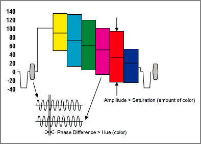
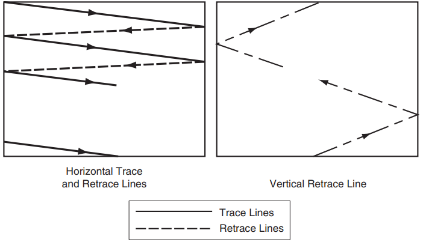
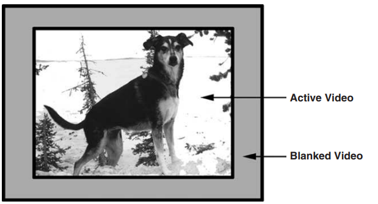
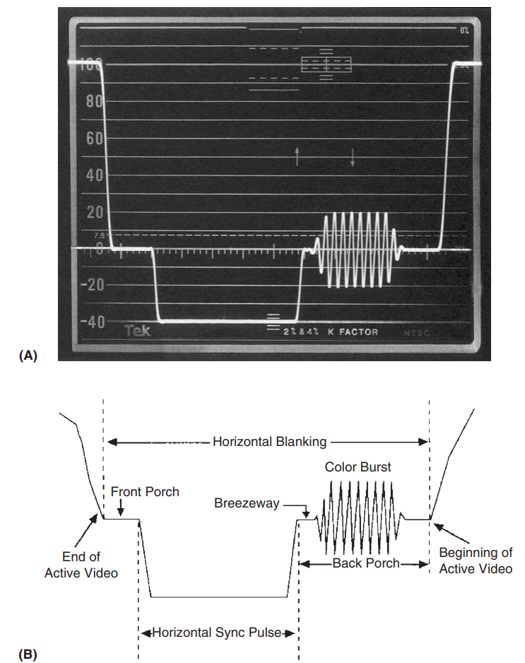
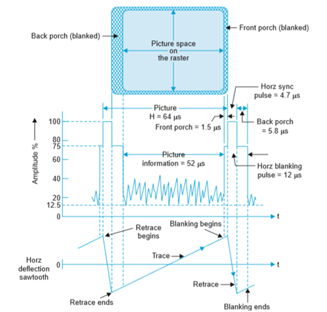

## basics
there is a preamble (between 4-8MHz) 8 period sine wave, the colour burst, that is sent before any video data thats used to sync the clocks of the video output device, and the video input device. to display colour on composite video the output device will change the phase of the signal relative to the colour burst signal to indicate the colours, with the brightness/intensity (luma) being determined by the amplitude

> Burst = 0 degrees  
Yellow = 15 degrees  
Red = 75 degrees  
Magenta = 135 degrees  
Blue = 195 degrees  
Cyan = 255 degrees  
Green = 315 degrees

This colour is seperate to the video stream. the video is actually sent in monochrome

The process of integration of visual intelligence is carried out by _scanning_.

> The scanning process consists of taking a horizontal strip across the image on which
discrete square elements called pels or pixels (picture elements) are scanned from left to right. When the right-hand end is reached, another, lower, horizontal strip is explored, and so on, until the whole image has been scanned

From what I understand scanning is similar to sampling the image, and then serialising this image

There are 3 main analogue video standards:
- NTSC - US
- PAL - EU/AU
- SECAM - EU

The NTSC standard divides the original image into 525 scanning lines, while PAL is 625. Note the number of scanning lines is the number of vertical bits.

the more scanning lines the more detail

aspect ratio refers to the width-to-height ratio. 4:3 is a universal standard.

an image divided into 525 (491) vertical elements would have 700 (652) horizontal elements to maintain an aspect ratio of 4:3. The numbers in parentheses represent the practical maximum active lines and elements

The sense of motion in the video is regulated by the frame rate. 25fps is the minimum to give a viewer the sense of motion. for less than 25fps the viewer will be disturbed by luminance flicker (bloom and decay), or the sensation that still pictures are “flicking” on screen one after the other.

To avoid any sort of luminance flicker sensation, the image is divided into two closely interwoven (interleaving) parts, and each part is presented in succession at a rate of 60 frames per second, even though complete pictures are still built up at a 30 frame-per-second rate.

>It has been found convenient to equate flicker frequency to power line frequency. Hence in North American practice, where power line frequency is 60 Hz, the flicker is 60 frames per second. In Europe it is 50 frames per second to correspond to the 50-Hz line frequency used there. Australia follows Europe.

reason is mentioned [here](https://electronics.stackexchange.com/questions/740938/why-does-the-powerline-frequency-have-anything-to-do-with-tv-framerate)

Important parameters for PAL encoding:

1. A field period is 1/50 sec. This is the time required to scan a full picture on every
horizontal line. i.e. one half of the total interlaced image
2. The second scan covers the lines not scanned on the first period, offset one-half
horizontal line.
3. Thus 1/25 sec is required to scan all lines on a complete picture.
4. 1 horizontal line should take 1/25 * 1/ 625 sec = 64 µsec. For NTSC its 63.5 µsec
5. Consider that about 16% of the 64 µsec is consumed in flyback and synchronization. Accordingly, only about 53 µsec are left per line of picture to transmit information.

## Blanking
electron beams in analogue TVs must retrace/go back to the other side of the screen to start the nest line, or go back to the top of the screen after each (half) frame

the preiod of time which the electron beam retraces to begin scanning a new line is called the **horizontal blanking**.

the period of time to retrace back to the top of the screen is the **vertical blanking**

during this time the beam of electrons is blanked out (at 0V) so as not to make the retrace visible on the screen

Horizontal blanking actually occurs slightly before the beginning of each line of video information. Vertical blanking occurs after each frame. 

the video itself is known as the **active video**.

### Horizontal blanking
Several critical synchronising signals occur during this horizontal blanking period:
- front porch - just the period of time that begins at the end of the active signal. it initiates the retrace and is the beginning of the sync period. A single scan line is defined as starting at the front porch and ending with active video before the next front porch begins.
- horizontal syncronising pulse - synchronises the source and receiver 
- back porch
    - breezeway
    - colour burst

### Vertical blanking
more complex than horizontal blanking.  During the vertical blanking period, there are pre- and post-equalizing pulses and vertical sync pulses, as well as several lines of blanked video. These are full lines of video on which there is no active picture.

#### Vertical sync pulses
part of the broadcast signal

essentially tells the TV (electron beam) to go back to the top of the screen

there are 6 vertical sync pulses that occur between fields

field: video is interlaced, creating two field: odd/even field

##### Equalising pulses
Emitted during the vertical blanking interval, they maintain sync during retrace and ensure correct interlacing of odd and even fields.

Pre-equalizing pulses (before vertical sync) and post-equalizing pulses (after vertical sync) split lines into half-lines.

Lines 1–9 contain pre-equalizing pulses (6 half-lines), vertical sync (6 pulses over 3 lines), and post-equalizing pulses (3 lines split into 5 or 6 half-lines, depending on field type).

Field Structure & Interlacing

Each field has 262.5 lines:
Odd field starts with a full line (line 21) and ends with a half-line.
Even field starts with a half-line (line 20) and ends with a full line.
Equalizing pulses distinguish odd/even fields, ensuring proper interlacing into a complete frame. Mismanagement could misalign fields.
